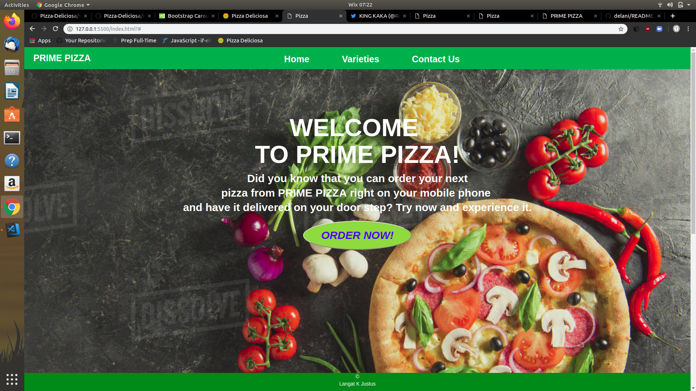

# PIZZA
## Author
kipkirui ronoh victor

# Description
- This is a website which deals with the pizza order and delivery. The customer can make an order of the number of Pizza they want and have it delivered on their preffered locations.

## Screenshot

## Setup Instructions
- Open Terminal {Ctrl+Alt+T}

- 

- cd Pizza

- code . if you are using vs code and atom . if you are using windows

## Technologies used
- HTML5
- CSS
- Bootstrap
- jQuery
## BDD
The customer can choose the size of the pizza he or she wants. Also the customer can choose more than one pizza and can select the favourite crust and toppings of their choice. Delivery option is available and the customer can choose his or her preffered location for delivery.

# LICENSE
Copyright 2022 kipkirui ronoh victor
Permission is hereby granted, free of charge, to any person obtaining a copy of this software and associated documentation files (the "Software"), to deal in the Software without restriction, including without limitation the rights to use, copy, modify, merge, publish, distribute, sublicense, and/or sell copies of the Software, and to permit persons to whom the Software is furnished to do so, subject to the following conditions:

The above copyright notice and this permission notice shall be included in all copies or substantial portions of the Software.

THE SOFTWARE IS PROVIDED "AS IS", WITHOUT WARRANTY OF ANY KIND, EXPRESS OR IMPLIED, INCLUDING BUT NOT LIMITED TO THE WARRANTIES OF MERCHANTABILITY, FITNESS FOR A PARTICULAR PURPOSE AND NONINFRINGEMENT. IN NO EVENT SHALL THE AUTHORS OR COPYRIGHT HOLDERS BE LIABLE FOR ANY CLAIM, DAMAGES OR OTHER LIABILITY, WHETHER IN AN ACTION OF CONTRACT, TORT OR OTHERWISE, ARISING FROM, OUT OF OR IN CONNECTION WITH THE SOFTWARE OR THE USE OR OTHER DEALINGS IN THE SOFTWARE.
